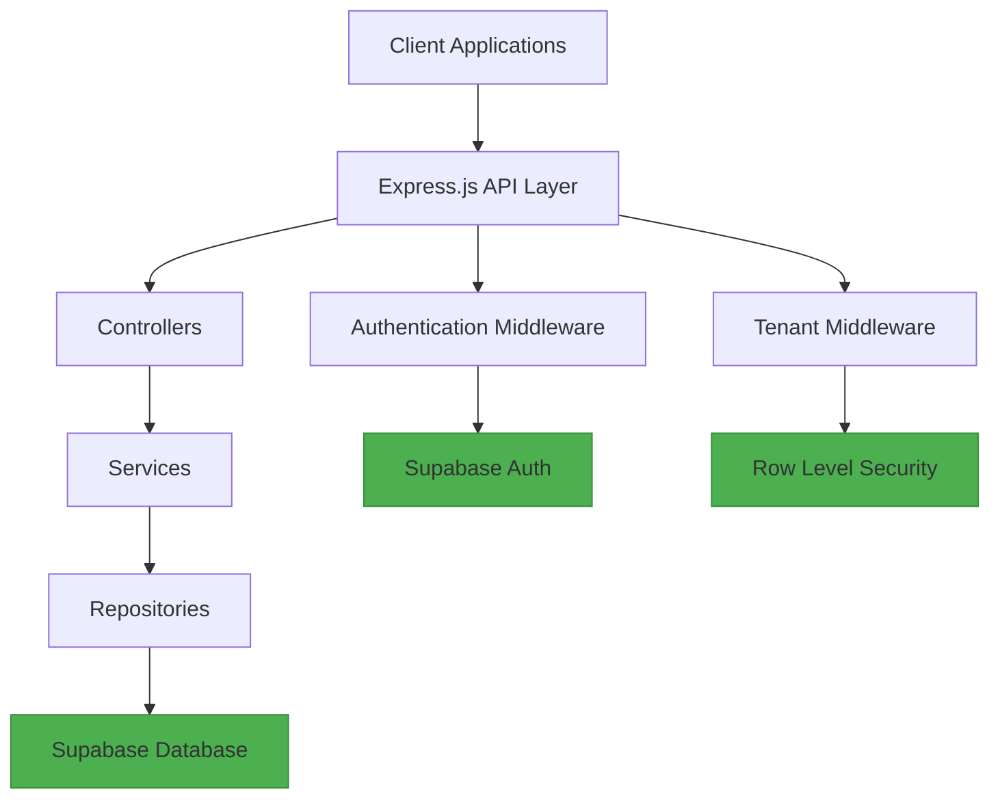

# Database Migration Design Document

## 1. Overview

This document outlines the completed database migration from CSV-based storage to Supabase PostgreSQL for the SyncUpEZ application. The migration transforms the application from a file-based system to a modern, scalable database solution while maintaining all existing functionality.

### Purpose
The purpose of this migration is to:
- Improve scalability and performance
- Enhance data integrity and consistency
- Provide better concurrency handling
- Implement robust multi-tenancy with Row Level Security
- Replace custom authentication with industry-standard Supabase Auth

### Scope
The migration affects all data storage and retrieval operations in the application, including:
- Employee management
- Interaction tracking
- Kudos system
- Contribution scoring
- Analytics engine

## 2. Architecture

### 2.1 System Architecture Pattern
The application follows a layered (n-tier) architecture with clear separation between routes, controllers, services, and repositories. The migration introduces a repository pattern that abstracts data access operations.



### 2.2 Key Components

#### 2.2.1 Repository Layer
The repository pattern provides a clean abstraction between business logic and data access:

- **EmployeeRepository**: Handles all employee data operations
- **InteractionRepository**: Manages interaction data
- **KudosRepository**: Handles kudos data operations
- **ContributionRepository**: Manages contribution scoring data

#### 2.2.2 Service Layer
Business logic is encapsulated in service classes that use repositories:

- **EmployeeService**: Employee business logic and validation
- **InteractionService**: Interaction processing and categorization
- **KudosService**: Kudos validation and processing
- **ScoringService**: Contribution score calculation algorithms

#### 2.2.3 Controller Layer
Controllers handle HTTP requests and responses:

- **EmployeeController**: Employee CRUD operations
- **InteractionController**: Interaction management
- **KudosController**: Kudos system endpoints
- **AuthController**: Authentication and registration

#### 2.2.4 Middleware
Middleware components handle cross-cutting concerns:

- **AuthMiddleware**: Token validation and user authentication
- **TenantMiddleware**: Tenant identification and context setting
- **DataIsolationMiddleware**: Ensures tenant data isolation

## 3. Data Models & Database Schema

### 3.1 Database Schema
The Supabase PostgreSQL database uses the following tables:

#### employees
| Column | Type | Description |
|--------|------|-------------|
| id | UUID | Primary key |
| tenant_id | TEXT | Multi-tenancy identifier |
| employee_id | TEXT | Unique employee identifier |
| name | TEXT | Employee name |
| email | TEXT | Employee email |
| password | TEXT | Hashed password |
| department | TEXT | Optional department |
| team | TEXT | Optional team |
| role | TEXT | Optional role |
| hire_date | DATE | Optional hire date |
| created_at | TIMESTAMP | Record creation timestamp |
| updated_at | TIMESTAMP | Record update timestamp |

#### interactions
| Column | Type | Description |
|--------|------|-------------|
| id | UUID | Primary key |
| tenant_id | TEXT | Multi-tenancy identifier |
| from_employee_id | TEXT | Source employee ID |
| to_employee_id | TEXT | Target employee ID |
| interaction_type | TEXT | Type of interaction |
| content | TEXT | Interaction content |
| timestamp | TIMESTAMP | Interaction timestamp |
| created_at | TIMESTAMP | Record creation timestamp |

#### kudos
| Column | Type | Description |
|--------|------|-------------|
| id | UUID | Primary key |
| tenant_id | TEXT | Multi-tenancy identifier |
| from_employee_id | TEXT | Source employee ID |
| to_employee_id | TEXT | Target employee ID |
| message | TEXT | Kudos message |
| timestamp | TIMESTAMP | Kudos timestamp |
| created_at | TIMESTAMP | Record creation timestamp |

#### contributions
| Column | Type | Description |
|--------|------|-------------|
| id | UUID | Primary key |
| tenant_id | TEXT | Multi-tenancy identifier |
| employee_id | TEXT | Employee ID |
| problem_solving_score | NUMERIC | Problem-solving score |
| collaboration_score | NUMERIC | Collaboration score |
| initiative_score | NUMERIC | Initiative score |
| overall_score | NUMERIC | Overall contribution score |
| calculated_at | TIMESTAMP | Score calculation timestamp |
| created_at | TIMESTAMP | Record creation timestamp |

#### tenants
| Column | Type | Description |
|--------|------|-------------|
| id | TEXT | Primary key |
| name | TEXT | Tenant name |
| created_at | TIMESTAMP | Record creation timestamp |
| updated_at | TIMESTAMP | Record update timestamp |

### 3.2 Row Level Security (RLS)
RLS policies ensure that tenants can only access their own data:

```sql
-- Example policy for employees table
CREATE POLICY "Employees are viewable by tenant" 
ON employees FOR SELECT 
USING (tenant_id = current_setting('app.tenant_id'));
```

## 4. Migration Strategy

### 4.1 Migration Process
The migration was implemented in the following phases:

1. **Dependency Integration**: Added Supabase client library and updated package.json
2. **Repository Layer**: Created repository pattern with Supabase client integration
3. **Service Layer**: Updated services to use new repositories
4. **Controller Layer**: Modified controllers to work with updated services
5. **Authentication**: Replaced custom JWT/bcrypt with Supabase Auth
6. **Middleware**: Updated middleware for tenant context and data isolation
7. **Database Schema**: Created tables and RLS policies
8. **Data Migration**: Implemented script to migrate existing CSV data to Supabase

### 4.2 Data Migration
A migration script (`scripts/migrateDataToSupabase.js`) was created to transfer existing CSV data to Supabase tables:

- Reads data from existing CSV files
- Inserts data into corresponding Supabase tables
- Maintains tenant isolation during migration
- Handles errors gracefully with detailed logging

### 4.3 Backward Compatibility
The migration maintains backward compatibility through:

- Environment-based configuration (SUPABASE_URL, SUPABASE_KEY)
- Updated package.json with new scripts
- Comprehensive error handling
- Detailed logging throughout the migration process

## 5. Security Implementation

### 5.1 Authentication
Supabase Auth replaces the custom JWT/bcrypt implementation:

- User registration with `supabase.auth.signUp()`
- User login with `supabase.auth.signInWithPassword()`
- Session management handled by Supabase

### 5.2 Multi-tenancy
Enhanced multi-tenancy implementation:

- Row Level Security policies enforce tenant isolation at the database level
- Tenant context is automatically set by middleware
- More robust than directory-based isolation

### 5.3 Data Protection
Data protection measures include:

- Password hashing with bcrypt before storage
- Transport encryption via HTTPS
- Row Level Security for data isolation
- Input validation and sanitization

## 6. Performance Improvements

### 6.1 Database Queries
Database queries are more efficient than file operations:

- Index-based lookups instead of full file scans
- Optimized query execution plans
- Connection pooling for better resource utilization

### 6.2 Concurrency Handling
Built-in database locking prevents race conditions:

- Atomic transactions ensure data consistency
- Concurrent access without file locking overhead
- Better handling of simultaneous requests

## 7. Testing Strategy

### 7.1 Unit Tests
Comprehensive unit tests for all components:

- Repository tests for data access operations
- Service tests for business logic
- Controller tests for HTTP request handling

### 7.2 Integration Tests
Integration tests verify end-to-end functionality:

- API endpoint testing
- Multi-tenancy isolation tests
- Authentication flow tests

### 7.3 Migration Tests
Tests to verify the migration process:

- Data integrity verification
- Tenant isolation validation
- Performance benchmarking

## 8. Deployment & Rollback

### 8.1 Deployment Process
The deployment process includes:

1. Setting up Supabase project
2. Configuring environment variables
3. Initializing database schema
4. Migrating existing data
5. Testing the implementation

### 8.2 Rollback Plan
If needed, the system can be rolled back to the CSV-based version:

1. Revert to the previous codebase
2. Restore CSV files from backup
3. Remove Supabase configuration

## 9. Benefits of Migration

### 9.1 Performance
- Database queries are more efficient than file operations
- Better handling of concurrent requests
- Improved response times

### 9.2 Scalability
- PostgreSQL can handle much larger datasets than CSV files
- Better resource utilization
- Support for horizontal scaling

### 9.3 Reliability
- Database transactions ensure data consistency
- Built-in backup and recovery mechanisms
- Reduced risk of data corruption

### 9.4 Maintainability
- Cleaner code structure with proper separation of concerns
- Industry-standard authentication
- Better error handling and logging