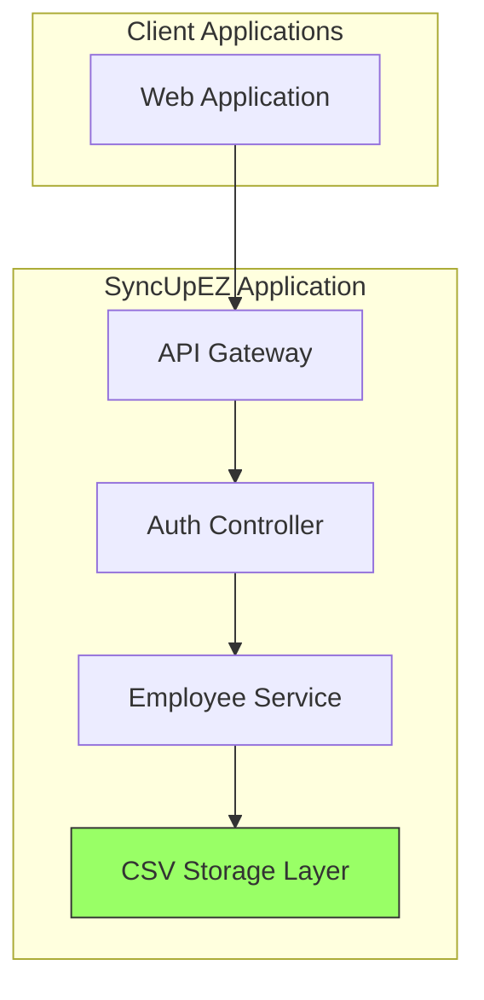

# Login Feature Implementation for SyncUpEZ

## Overview

This document outlines the implementation of a simple login feature for SyncUpEZ using email and password authentication with CSV-based storage. The login feature will allow users to authenticate using their email and password credentials stored in the employees.csv file.

## Architecture

The login feature will be integrated into the existing SyncUpEZ architecture, utilizing the CSV-based storage approach:



## Data Model

### employees.csv (Updated)

The existing employees.csv file will be updated to include a password field for authentication:

| Field | Type | Description |
|-------|------|-------------|
| employee_id | string | Unique identifier for the employee |
| name | string | Employee's full name |
| email | string | Employee's email address (used for login) |
| password | string | Hashed password for authentication |
| department | string | Department the employee belongs to |
| team | string | Team within the department |
| role | string | Employee's role/title |
| hire_date | date | Date the employee was hired |

## API Endpoints

### Login Endpoint

```
POST /api/auth/login
```

#### Request Body
```json
{
  "email": "user@example.com",
  "password": "userpassword"
}
```

#### Response
```json
{
  "success": true,
  "token": "jwt_token_here",
  "employee": {
    "employee_id": "emp_001",
    "name": "John Doe",
    "email": "john.doe@example.com",
    "department": "Engineering",
    "team": "Backend",
    "role": "Software Engineer",
    "hire_date": "2023-01-15"
  }
}
```

#### Error Responses
- 400 Bad Request: Missing email or password
- 401 Unauthorized: Invalid credentials
- 500 Internal Server Error: System error

## Implementation Details

### 1. Password Hashing

Passwords will be securely hashed using bcrypt before storage:

```javascript
const bcrypt = require('bcrypt');

// Hash password before saving
const hashPassword = async (password) => {
  const saltRounds = 10;
  return await bcrypt.hash(password, saltRounds);
};

// Compare password during login
const comparePassword = async (password, hash) => {
  return await bcrypt.compare(password, hash);
};
```

### 2. Authentication Controller

A new authentication controller will handle login requests:

```javascript
// src/controllers/authController.js
const { readCSV } = require('../utils/csvReader');
const bcrypt = require('bcrypt');
const jwt = require('jsonwebtoken');
const path = require('path');

const EMPLOYEES_FILE = path.join(__dirname, '../../data/employees.csv');

async function login(req, res) {
  try {
    const { email, password } = req.body;
    
    // Validate input
    if (!email || !password) {
      return res.status(400).json({ error: 'Email and password are required' });
    }
    
    // Find employee by email
    const employees = await readCSV(EMPLOYEES_FILE);
    const employee = employees.find(emp => emp.email === email);
    
    if (!employee) {
      return res.status(401).json({ error: 'Invalid credentials' });
    }
    
    // Verify password
    const isPasswordValid = await bcrypt.compare(password, employee.password);
    
    if (!isPasswordValid) {
      return res.status(401).json({ error: 'Invalid credentials' });
    }
    
    // Generate JWT token
    const token = jwt.sign(
      { employee_id: employee.employee_id, email: employee.email },
      process.env.JWT_SECRET || 'default_secret',
      { expiresIn: '1h' }
    );
    
    // Remove password from response
    const { password: _, ...employeeData } = employee;
    
    res.json({
      success: true,
      token,
      employee: employeeData
    });
  } catch (error) {
    res.status(500).json({ error: 'Login failed' });
  }
}

module.exports = { login };
```

### 3. Authentication Routes

New routes for authentication will be added:

```javascript
// src/routes/authRoutes.js
const express = require('express');
const router = express.Router();
const authController = require('../controllers/authController');

/**
 * Authentication Routes
 */

// Login endpoint
router.post('/login', authController.login);

module.exports = router;
```

### 4. Integration with Main Application

The authentication routes will be integrated into the main server:

```javascript
// server.js (updated)
const express = require('express');
const app = express();
const PORT = process.env.PORT || 3000;

// Middleware
app.use(express.json());

// Import routes
const employeeRoutes = require('./src/routes/employeeRoutes');
const authRoutes = require('./src/routes/authRoutes');

// Use routes
app.use('/api/employees', employeeRoutes);
app.use('/api/auth', authRoutes);

// Basic route for testing
app.get('/', (req, res) => {
  res.json({ 
    message: 'SyncUpEZ Server Running', 
    version: '1.0.0',
    description: 'CSV-based implementation of SyncUp Continuous Contribution Graph'
  });
});

// Start server
app.listen(PORT, () => {
  console.log(`SyncUpEZ server is running on port ${PORT}`);
});

module.exports = app;
```

## Security Considerations

1. **Password Storage**: Passwords are hashed using bcrypt before storage
2. **Token Expiration**: JWT tokens have a 1-hour expiration time
3. **Environment Variables**: JWT secret is stored in environment variables
4. **Input Validation**: All inputs are validated before processing
5. **Error Handling**: Generic error messages to prevent information leakage

## Performance Considerations

1. **File I/O**: Reading the entire employees.csv file for each login request
2. **Memory Usage**: Loading all employee data into memory for each authentication attempt
3. **Optimization**: For production use, consider caching employee data in memory

## Testing

### Unit Tests for Authentication

```javascript
// test/auth.test.js
describe('Authentication', () => {
  describe('POST /api/auth/login', () => {
    it('should authenticate valid user', async () => {
      // Test implementation
    });
    
    it('should reject invalid credentials', async () => {
      // Test implementation
    });
    
    it('should reject missing credentials', async () => {
      // Test implementation
    });
  });
});
```

## Deployment

1. Install required dependencies:
   ```bash
   npm install bcrypt jsonwebtoken
   ```

2. Set environment variables:
   ```bash
   JWT_SECRET=your_jwt_secret_here
   ```

3. Update employee creation to hash passwords:
   ```javascript
   // In employeeController.js
   const bcrypt = require('bcrypt');
   
   async function createEmployee(req, res) {
     try {
       const employee = req.body;
       
       // Validate required fields
       if (!employee.employee_id || !employee.name || !employee.email || !employee.password) {
         return res.status(400).json({ error: 'Missing required fields: employee_id, name, email, password' });
       }
       
       // Hash password
       employee.password = await bcrypt.hash(employee.password, 10);
       
       // Define headers for employees.csv
       const headers = [
         {id: 'employee_id', title: 'employee_id'},
         {id: 'name', title: 'name'},
         {id: 'email', title: 'email'},
         {id: 'password', title: 'password'},
         {id: 'department', title: 'department'},
         {id: 'team', title: 'team'},
         {id: 'role', title: 'role'},
         {id: 'hire_date', title: 'hire_date'}
       ];
       
       await appendCSV(EMPLOYEES_FILE, headers, employee);
       
       res.status(201).json({ message: 'Employee created successfully', employee });
     } catch (error) {
       res.status(500).json({ error: 'Failed to create employee' });
     }
   }
   ```

## Limitations

1. **Scalability**: Reading entire CSV file for each login request doesn't scale well
2. **Concurrency**: File locking may be needed for concurrent access
3. **Security**: CSV storage is less secure than database storage
4. **Performance**: Slower authentication compared to database queries