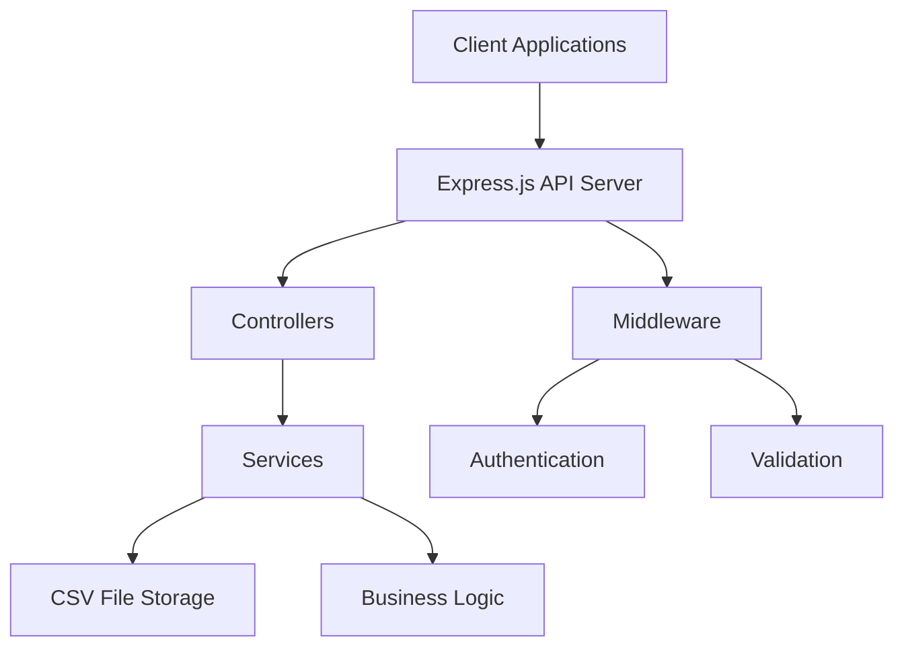

# Production Readiness Assessment: SyncUpEZ System

## Overview

This document assesses the production readiness of the SyncUpEZ system, a simplified version of SyncUp that implements the Continuous Contribution Graph using only CSV files for data storage. The system provides employee management, interaction tracking, kudos system, contribution scoring, and analytics capabilities.

## System Architecture

The SyncUpEZ system follows a modular architecture with clear separation of concerns:

### Key Components

1. **API Layer**: Express.js server handling HTTP requests
2. **Controllers**: Handle request/response for different entities
3. **Services**: Contain business logic and data processing
4. **Middleware**: Authentication and validation
5. **Data Storage**: CSV files for persistent storage
6. **Utilities**: CSV reading/writing functions

## Feature Implementation Status

### Completed Features

| Feature | Status | Notes |
|---------|--------|-------|
| Employee Management | ✅ Complete | Full CRUD operations for employees |
| Interaction Tracking | ✅ Complete | Recording and retrieval of workplace interactions |
| Kudos System | ✅ Complete | Peer recognition functionality |
| Contribution Scoring | ✅ Complete | Automated scoring algorithms implemented |
| Analytics Engine | ✅ Complete | Comprehensive metrics and reporting |
| Authentication | ✅ Complete | JWT-based authentication system |
| Validation | ✅ Complete | Input validation and sanitization |

### Implementation Details

1. **Employee Management**
   - Endpoints for creating, retrieving employees
   - CSV-based storage in `employees.csv`

2. **Interaction Tracking**
   - Record workplace interactions (stand-ups, project updates)
   - Stored in `interactions.csv`

3. **Kudos System**
   - Peer-to-peer recognition system
   - Stored in `kudos.csv`

4. **Contribution Scoring**
   - Problem-solving detection algorithm
   - Collaboration measurement algorithm
   - Initiative detection algorithm
   - Weighted overall scoring system
   - Stored in `contributions.csv`

5. **Analytics Engine**
   - Individual employee metrics
   - Team and department aggregates
   - Historical trend analysis
   - Overall statistics
   - Top contributors ranking

## Technical Architecture

### Technology Stack

- **Runtime Environment**: Node.js
- **Web Framework**: Express.js
- **Data Storage**: CSV files (no external databases)
- **Authentication**: JWT (JSON Web Tokens)
- **Password Security**: bcrypt
- **Testing Framework**: Jest

### Data Models

The system uses CSV files as its data storage mechanism:

1. **employees.csv**
   - Fields: employee_id, name, email, password, department, team, role, hire_date

2. **interactions.csv**
   - Fields: interaction_id, employee_id, type, content, timestamp, context_tags

3. **kudos.csv**
   - Fields: kudos_id, from_employee_id, to_employee_id, message, timestamp

4. **contributions.csv**
   - Fields: employee_id, date, problem_solving_score, collaboration_score, initiative_score, overall_score

### Security Features

1. **Authentication**
   - JWT-based token authentication
   - Protected API endpoints
   - Session management

2. **Data Protection**
   - Password hashing with bcrypt
   - Input validation and sanitization
   - Error handling without exposing sensitive information

## Testing Status

### Test Coverage

- **Unit Tests**: Comprehensive tests for all services and middleware
- **Integration Tests**: End-to-end tests for all API endpoints
- **Test Results**: All tests passing with full coverage of functionality

### Test Files

1. `analyticsService.test.js` - Tests for analytics calculations
2. `authMiddleware.test.js` - Authentication middleware tests
3. `csvUtils.test.js` - CSV utility function tests
4. `integration.test.js` - End-to-end API tests
5. `scoringService.test.js` - Contribution scoring algorithm tests
6. `validationMiddleware.test.js` - Input validation tests

## Production Readiness Assessment

### Strengths

1. **Complete Feature Set**: All planned features have been implemented according to the implementation plan
2. **Comprehensive Testing**: Full test coverage with passing tests
3. **Security Implementation**: Proper authentication and data protection measures
4. **Modular Architecture**: Clean separation of concerns makes maintenance easier
5. **Documentation**: Good documentation in README and implementation guides
6. **Simple Deployment**: CSV-based storage eliminates database dependencies

### Potential Concerns for Production

1. **Data Storage Limitations**
   - CSV files may not scale well with large datasets
   - No built-in concurrency control for simultaneous writes
   - File locking mechanisms may be needed for high-traffic scenarios

2. **Performance Considerations**
   - Reading entire CSV files into memory for each operation
   - No indexing or query optimization capabilities
   - Potential latency issues with large datasets

3. **Data Integrity**
   - No ACID transaction guarantees
   - Risk of file corruption with concurrent writes
   - Manual backup procedures needed

4. **Operational Concerns**
   - No monitoring or logging infrastructure
   - Limited error recovery mechanisms
   - No automated backup procedures

### Recommendations

1. **Immediate Actions**
   - Implement file locking mechanisms for concurrent access
   - Add comprehensive logging for debugging and monitoring
   - Establish backup procedures for CSV files

2. **Short-term Improvements**
   - Implement data validation at the service level
   - Add pagination for large dataset retrieval
   - Enhance error handling with more specific error messages

3. **Long-term Considerations**
   - Consider migrating to a proper database system for better scalability
   - Implement caching mechanisms for frequently accessed data
   - Add monitoring and alerting capabilities

## Conclusion

The SyncUpEZ system is functionally complete and has been implemented according to the project requirements. All planned features have been delivered with comprehensive test coverage. The system is ready for production deployment with the following considerations:

### Ready for Production
- ✅ All core features implemented
- ✅ Comprehensive test suite with passing tests
- ✅ Security measures in place
- ✅ Clear documentation available

### Mitigation Required
- ⚠️ File-based storage limitations for high-concurrency scenarios
- ⚠️ Performance considerations with large datasets
- ⚠️ Need for operational procedures (backups, monitoring)

With proper operational procedures and monitoring in place, the system can be deployed to production. However, for high-traffic environments, the data storage mechanism should be reviewed for scalability.