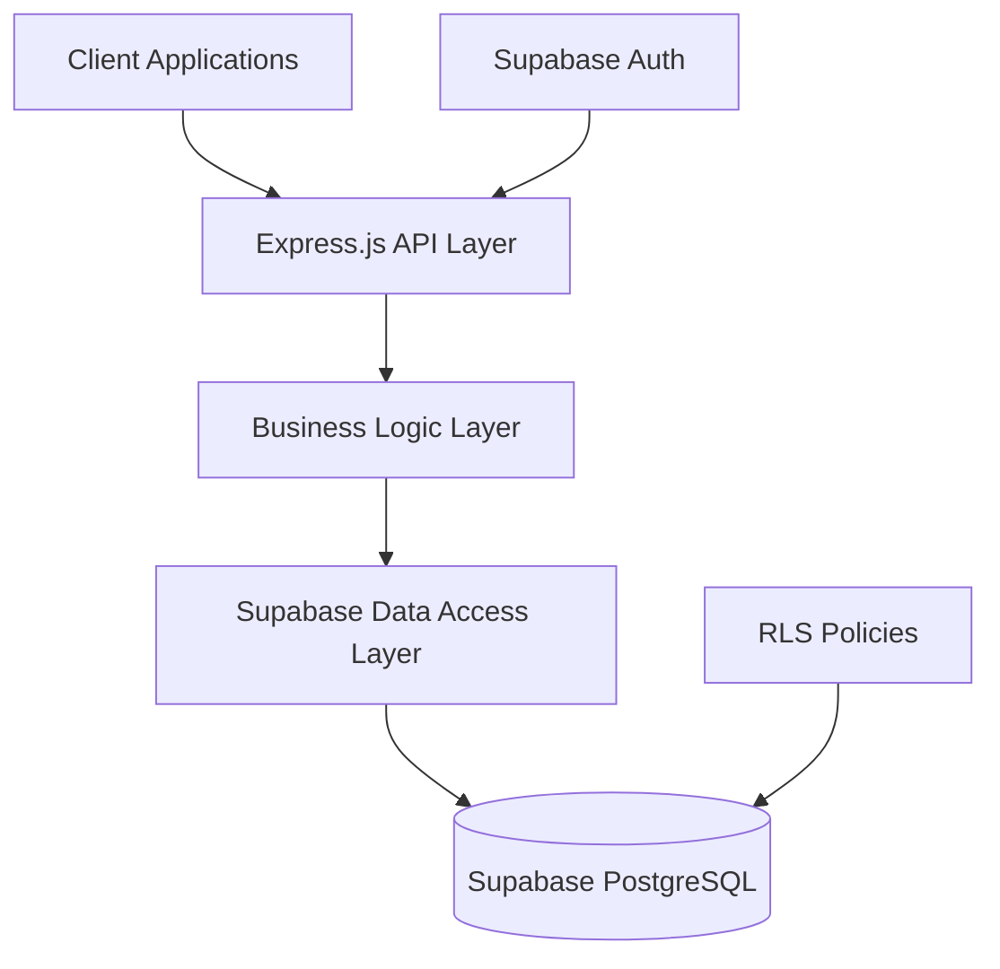

# Supabase Integration Design for SyncUpEZ

## 1. Overview

This document outlines the redesign of SyncUpEZ to use Supabase's free tier instead of CSV files for data storage. The migration will replace the current file-based storage system with a PostgreSQL database while maintaining all existing functionality including multi-tenancy support.

### Current Architecture
- Uses CSV files for data storage with file locking for concurrency control
- Implements multi-tenancy through tenant-specific directories
- Provides REST APIs for employee management, interactions, kudos, analytics, etc.

### Target Architecture
- Replace CSV files with Supabase PostgreSQL database
- Maintain multi-tenancy through Row Level Security (RLS) policies
- Continue using existing REST API structure with updated data layer

## 2. Architecture

### 2.1 High-Level Architecture


### 2.2 Key Components
1. **Express.js API Layer**: Existing REST API endpoints remain unchanged
2. **Business Logic Layer**: Existing service layer with updated data access
3. **Supabase Data Access Layer**: New layer replacing CSV utilities
4. **Supabase PostgreSQL**: Database storage replacing CSV files
5. **Supabase Auth**: Authentication system replacing JWT/bcrypt
6. **RLS Policies**: Row Level Security for multi-tenancy

### 2.3 Multi-Tenancy Implementation
The current directory-based multi-tenancy will be replaced with Supabase's Row Level Security (RLS) policies:
- Each database record will include a `tenant_id` column
- RLS policies will ensure tenants can only access their own data
- Tenant identification will continue using existing middleware

## 3. API Endpoints Reference

The existing API endpoints will remain unchanged in structure and functionality, only the underlying data storage will be migrated from CSV files to Supabase PostgreSQL.

### 3.1 Authentication Endpoints
- `POST /api/auth/login` - Authenticate user via Supabase
- `POST /api/auth/register` - Register new user via Supabase

### 3.2 Employee Management Endpoints
- `GET /api/employees` - Retrieve all employees for tenant
- `GET /api/employees/:id` - Retrieve specific employee
- `POST /api/employees` - Create new employee
- `PUT /api/employees/:id` - Update employee
- `DELETE /api/employees/:id` - Delete employee

## 4. Data Models & Database Schema

### 4.1 Employees Table
```sql
CREATE TABLE employees (
  id UUID PRIMARY KEY DEFAULT uuid_generate_v4(),
  tenant_id TEXT NOT NULL,
  employee_id TEXT NOT NULL,
  name TEXT NOT NULL,
  email TEXT NOT NULL,
  department TEXT,
  team TEXT,
  role TEXT,
  hire_date DATE,
  created_at TIMESTAMP DEFAULT NOW(),
  updated_at TIMESTAMP DEFAULT NOW()
);
```

### 4.2 Interactions Table
```sql
CREATE TABLE interactions (
  id UUID PRIMARY KEY DEFAULT uuid_generate_v4(),
  tenant_id TEXT NOT NULL,
  from_employee_id TEXT NOT NULL,
  to_employee_id TEXT NOT NULL,
  interaction_type TEXT NOT NULL,
  content TEXT,
  timestamp TIMESTAMP DEFAULT NOW(),
  created_at TIMESTAMP DEFAULT NOW()
);
```

### 4.3 Kudos Table
```sql
CREATE TABLE kudos (
  id UUID PRIMARY KEY DEFAULT uuid_generate_v4(),
  tenant_id TEXT NOT NULL,
  from_employee_id TEXT NOT NULL,
  to_employee_id TEXT NOT NULL,
  message TEXT NOT NULL,
  timestamp TIMESTAMP DEFAULT NOW(),
  created_at TIMESTAMP DEFAULT NOW()
);
```

### 4.4 Database Indexes
To optimize query performance, the following indexes should be created:

```sql
-- Indexes for employees table
CREATE INDEX idx_employees_tenant_id ON employees(tenant_id);
CREATE INDEX idx_employees_employee_id ON employees(employee_id);
CREATE INDEX idx_employees_email ON employees(email);

-- Indexes for interactions table
CREATE INDEX idx_interactions_tenant_id ON interactions(tenant_id);
CREATE INDEX idx_interactions_from_employee ON interactions(from_employee_id);
CREATE INDEX idx_interactions_to_employee ON interactions(to_employee_id);
CREATE INDEX idx_interactions_timestamp ON interactions(timestamp);

-- Indexes for kudos table
CREATE INDEX idx_kudos_tenant_id ON kudos(tenant_id);
CREATE INDEX idx_kudos_from_employee ON kudos(from_employee_id);
CREATE INDEX idx_kudos_to_employee ON kudos(to_employee_id);
CREATE INDEX idx_kudos_timestamp ON kudos(timestamp);
```

## 5. Business Logic Layer

### 5.1 Data Access Layer
Replace existing CSV utilities with Supabase client wrapper:

#### Package Dependencies
To implement the Supabase integration, the following dependencies need to be added to `package.json`:

```json
{
  "dependencies": {
    "@supabase/supabase-js": "^2.38.0"
  }
}
```

Run `npm install @supabase/supabase-js` to install the Supabase client library.

After installation, the existing CSV-related dependencies can be removed:

```json
{
  "dependencies": {
    "csv-parser": "^3.0.0",
    "csv-writer": "^1.6.0",
    "proper-lockfile": "^4.1.2"
  }
}
```

These can be removed with `npm uninstall csv-parser csv-writer proper-lockfile` after the migration is complete.

#### Supabase Client Initialization
```javascript
// src/utils/supabaseClient.js
const { createClient } = require('@supabase/supabase-js');

const supabaseUrl = process.env.SUPABASE_URL;
const supabaseKey = process.env.SUPABASE_KEY;

// Validate environment variables
if (!supabaseUrl || !supabaseKey) {
  throw new Error('SUPABASE_URL and SUPABASE_KEY must be set in environment variables');
}

const supabase = createClient(supabaseUrl, supabaseKey, {
  auth: {
    autoRefreshToken: true,
    persistSession: true,
    detectSessionInUrl: false
  },
  db: {
    schema: 'public'
  }
});

module.exports = supabase;
```

#### Employee Data Access
```javascript
// src/repositories/employeeRepository.js
const supabase = require('../utils/supabaseClient');

async function getEmployees(tenantId, page = 1, limit = 10) {
  const offset = (page - 1) * limit;
  
  const { data, error, count } = await supabase
    .from('employees')
    .select('*', { count: 'exact' })
    .eq('tenant_id', tenantId)
    .range(offset, offset + limit - 1);
  
  if (error) throw new Error(error.message);
  
  return {
    data,
    pagination: {
      page,
      limit,
      totalCount: count,
      totalPages: Math.ceil(count / limit)
    }
  };
}

async function getEmployeeById(tenantId, employeeId) {
  const { data, error } = await supabase
    .from('employees')
    .select('*')
    .eq('tenant_id', tenantId)
    .eq('employee_id', employeeId)
    .single();
  
  if (error) throw new Error(error.message);
  return data;
}

async function createEmployee(tenantId, employeeData) {
  // Hash password before storing
  const bcrypt = require('bcrypt');
  const hashedPassword = await bcrypt.hash(employeeData.password, 10);
  
  const { data, error } = await supabase
    .from('employees')
    .insert([{ 
      ...employeeData, 
      tenant_id: tenantId,
      password: hashedPassword
    }])
    .select();
  
  if (error) throw new Error(error.message);
  
  // Remove password from returned data
  const { password, ...employeeWithoutPassword } = data[0];
  return employeeWithoutPassword;
}

async function updateEmployee(tenantId, employeeId, employeeData) {
  // Remove password from update data if not provided
  const { password, ...updateData } = employeeData;
  
  // Hash password if provided
  let updatePayload = updateData;
  if (password) {
    const bcrypt = require('bcrypt');
    updatePayload.password = await bcrypt.hash(password, 10);
  }
  
  const { data, error } = await supabase
    .from('employees')
    .update(updatePayload)
    .eq('tenant_id', tenantId)
    .eq('employee_id', employeeId)
    .select();
  
  if (error) throw new Error(error.message);
  
  // Remove password from returned data
  const { password: _, ...employeeWithoutPassword } = data[0];
  return employeeWithoutPassword;
}

async function deleteEmployee(tenantId, employeeId) {
  const { data, error } = await supabase
    .from('employees')
    .delete()
    .eq('tenant_id', tenantId)
    .eq('employee_id', employeeId)
    .select();
  
  if (error) throw new Error(error.message);
  return data[0];
}

module.exports = {
  getEmployees,
  getEmployeeById,
  createEmployee,
  updateEmployee,
  deleteEmployee
};
```

### 5.2 Service Layer Modifications
Update existing services to use new repository layer with enhanced validation and error handling:

#### Employee Service
```javascript
// src/services/employeeService.js
const employeeRepository = require('../repositories/employeeRepository');

async function getEmployees(tenantId, page = 1, limit = 10) {
  // Validate pagination parameters
  if (page < 1 || limit < 1 || limit > 100) {
    throw new Error('Invalid pagination parameters. Page must be >= 1 and limit must be between 1 and 100.');
  }
  
  return await employeeRepository.getEmployees(tenantId, page, limit);
}

async function getEmployeeById(tenantId, employeeId) {
  // Validate employeeId
  if (!employeeId) {
    throw new Error('Employee ID is required');
  }
  
  return await employeeRepository.getEmployeeById(tenantId, employeeId);
}

async function createEmployee(tenantId, employeeData) {
  // Validate employee data
  const validation = validateEmployeeData(employeeData);
  if (!validation.isValid) {
    throw new Error(`Validation failed: ${validation.errors.join(', ')}`);
  }
  
  // Check if employee ID already exists
  try {
    const existingEmployee = await employeeRepository.getEmployeeById(tenantId, employeeData.employee_id);
    if (existingEmployee) {
      throw new Error('Employee ID already exists');
    }
  } catch (error) {
    // If error is not "not found", rethrow it
    if (!error.message.includes('not found')) {
      throw error;
    }
    // If employee not found, that's what we want
  }
  
  return await employeeRepository.createEmployee(tenantId, employeeData);
}

function validateEmployeeData(employee) {
  const errors = [];
  
  // Required fields
  if (!employee.employee_id) {
    errors.push('Employee ID is required');
  }
  
  if (!employee.name) {
    errors.push('Name is required');
  }
  
  if (!employee.email) {
    errors.push('Email is required');
  } else if (!/^[^\s@]+@[^\s@]+\.[^\s@]+$/.test(employee.email)) {
    errors.push('Email is invalid');
  }
  
  if (!employee.password) {
    errors.push('Password is required');
  } else if (employee.password.length < 6) {
    errors.push('Password must be at least 6 characters long');
  }
  
  // Optional fields validation
  if (employee.department && employee.department.length > 50) {
    errors.push('Department must be less than 50 characters');
  }
  
  if (employee.team && employee.team.length > 50) {
    errors.push('Team must be less than 50 characters');
  }
  
  if (employee.role && employee.role.length > 50) {
    errors.push('Role must be less than 50 characters');
  }
  
  if (employee.hire_date) {
    const dateRegex = /^\d{4}-\d{2}-\d{2}$/;
    if (!dateRegex.test(employee.hire_date)) {
      errors.push('Hire date must be in YYYY-MM-DD format');
    } else {
      const date = new Date(employee.hire_date);
      if (isNaN(date.getTime())) {
        errors.push('Hire date is invalid');
      }
    }
  }
  
  return {
    isValid: errors.length === 0,
    errors
  };
}

module.exports = {
  getEmployees,
  getEmployeeById,
  createEmployee
};
```

### 5.3 Controller Layer
Controllers remain largely unchanged, only updating data access methods with enhanced error handling:

#### Employee Controller
```javascript
// src/controllers/employeeController.js
const employeeService = require('../services/employeeService');

async function getEmployees(req, res) {
  try {
    const tenantId = req.tenantId || 'default';
    
    // Get pagination parameters from query
    const page = parseInt(req.query.page) || 1;
    const limit = parseInt(req.query.limit) || 10;
    
    const result = await employeeService.getEmployees(tenantId, page, limit);
    res.json(result);
  } catch (error) {
    if (error.message.includes('Invalid pagination parameters')) {
      return res.status(400).json({ error: error.message });
    }
    
    res.status(500).json({ error: 'Failed to retrieve employees' });
  }
}

async function getEmployeeById(req, res) {
  try {
    const { id } = req.params;
    const tenantId = req.tenantId || 'default';
    
    const employee = await employeeService.getEmployeeById(tenantId, id);
    res.json(employee);
  } catch (error) {
    if (error.message.includes('not found')) {
      return res.status(404).json({ error: 'Employee not found' });
    }
    
    res.status(500).json({ error: 'Failed to retrieve employee' });
  }
}

async function createEmployee(req, res) {
  try {
    const employeeData = req.body;
    const tenantId = req.tenantId || 'default';
    
    const employee = await employeeService.createEmployee(tenantId, employeeData);
    res.status(201).json({ message: 'Employee created successfully', employee });
  } catch (error) {
    if (error.message.includes('Validation failed') || 
        error.message.includes('already exists') || 
        error.message.includes('required') || 
        error.message.includes('invalid')) {
      return res.status(400).json({ error: error.message });
    }
    
    if (error.message.includes('already exists')) {
      return res.status(409).json({ error: 'Employee already exists' });
    }
    
    res.status(500).json({ error: 'Failed to create employee' });
  }
}

module.exports = {
  getEmployees,
  getEmployeeById,
  createEmployee
};
```

## 6. Multi-Tenancy Implementation

### 6.1 Row Level Security Policies
Implement RLS policies to ensure data isolation:

```sql
-- Enable RLS on all tables
ALTER TABLE employees ENABLE ROW LEVEL SECURITY;
ALTER TABLE interactions ENABLE ROW LEVEL SECURITY;
ALTER TABLE kudos ENABLE ROW LEVEL SECURITY;

-- Create policies for employees table
CREATE POLICY "Employees are viewable by tenant" 
ON employees FOR SELECT 
USING (tenant_id = current_setting('app.tenant_id'));

CREATE POLICY "Employees are insertable by tenant" 
ON employees FOR INSERT 
WITH CHECK (tenant_id = current_setting('app.tenant_id'));

CREATE POLICY "Employees are updateable by tenant" 
ON employees FOR UPDATE 
USING (tenant_id = current_setting('app.tenant_id'));

CREATE POLICY "Employees are deletable by tenant" 
ON employees FOR DELETE 
USING (tenant_id = current_setting('app.tenant_id'));
```

### 6.2 Tenant Context Middleware
Update middleware to set tenant context for RLS:

```javascript
// src/middleware/tenantMiddleware.js
function resolveTenant(req, res, next) {
  // Existing tenant resolution logic
  const tenantId = extractTenantId(req);
  req.tenantId = tenantId;
  
  // Set tenant context for Supabase RLS
  const supabase = require('../utils/supabaseClient');
  supabase.rpc('set_tenant_context', { tenant_id: tenantId });
  
  next();
}
```

### 6.3 Tenant Context Function
Create PostgreSQL function to set tenant context:

```sql
-- Create function to set tenant context
CREATE OR REPLACE FUNCTION set_tenant_context(tenant_id TEXT)
RETURNS VOID AS $$
BEGIN
  PERFORM set_config('app.tenant_id', tenant_id, false);
END;
$$ LANGUAGE plpgsql SECURITY DEFINER;
```

## 7. Authentication Migration

### 7.1 Supabase Auth Integration
Replace existing JWT/bcrypt authentication with Supabase Auth:

```javascript
// src/controllers/authController.js
const supabase = require('../utils/supabaseClient');

async function login(req, res) {
  try {
    const { email, password } = req.body;
    
    // Validate input
    if (!email || !password) {
      return res.status(400).json({ error: 'Email and password are required' });
    }
    
    const { data, error } = await supabase.auth.signInWithPassword({
      email,
      password
    });
    
    if (error) {
      return res.status(401).json({ error: 'Invalid credentials' });
    }
    
    // Get tenant ID from request (set by tenant middleware)
    const tenantId = req.tenantId || 'default';
    
    // Add tenant context to user object
    const userWithTenant = {
      ...data.user,
      tenant_id: tenantId
    };
    
    res.json({
      success: true,
      user: userWithTenant,
      session: data.session
    });
  } catch (error) {
    res.status(500).json({ error: 'Login failed' });
  }
}

async function register(req, res) {
  try {
    const { email, password, name, employee_id } = req.body;
    
    // Validate input
    if (!email || !password || !name || !employee_id) {
      return res.status(400).json({ error: 'Email, password, name, and employee_id are required' });
    }
    
    // Validate password strength
    if (password.length < 6) {
      return res.status(400).json({ error: 'Password must be at least 6 characters long' });
    }
    
    // Register user with Supabase Auth
    const { data, error } = await supabase.auth.signUp({
      email,
      password,
      options: {
        data: {
          name,
          employee_id,
          tenant_id: req.tenantId || 'default'
        }
      }
    });
    
    if (error) {
      if (error.message.includes('already registered')) {
        return res.status(409).json({ error: 'User already registered' });
      }
      return res.status(400).json({ error: error.message });
    }
    
    // Also create employee record in employees table
    const employeeData = {
      employee_id,
      name,
      email,
      tenant_id: req.tenantId || 'default'
    };
    
    // This would call the employee service to create the employee record
    // For brevity, we're showing the concept here
    
    res.status(201).json({
      success: true,
      message: 'User registered successfully',
      user: data.user
    });
  } catch (error) {
    res.status(500).json({ error: 'Registration failed' });
  }
}

module.exports = {
  login,
  register
};
```

### 7.2 Auth Middleware Update
Update authentication middleware to work with Supabase sessions:

```javascript
// src/middleware/authMiddleware.js
const supabase = require('../utils/supabaseClient');

async function authenticate(req, res, next) {
  try {
    const authHeader = req.headers.authorization;
    
    if (!authHeader) {
      return res.status(401).json({ error: 'Authorization header missing' });
    }
    
    const token = authHeader.replace('Bearer ', '');
    
    // Validate token format
    if (!token) {
      return res.status(401).json({ error: 'Invalid token format' });
    }
    
    const { data, error } = await supabase.auth.getUser(token);
    
    if (error || !data.user) {
      return res.status(401).json({ error: 'Invalid token' });
    }
    
    // Verify tenant ID matches request context
    const requestTenantId = req.tenantId || 'default';
    const userTenantId = data.user.user_metadata?.tenant_id || 'default';
    
    if (requestTenantId !== userTenantId) {
      return res.status(403).json({ error: 'Access denied: Tenant mismatch' });
    }
    
    req.user = data.user;
    next();
  } catch (error) {
    res.status(401).json({ error: 'Authentication failed' });
  }
}

module.exports = {
  authenticate
};
```

## 8. Migration Strategy

### 8.1 Data Migration Process
1. Create database schema in Supabase
2. Develop migration scripts to transfer data from CSV to PostgreSQL
3. Test migration with sample data
4. Execute migration for all tenants
5. Validate data integrity
6. Update application configuration
7. Deploy new code
8. Monitor system performance

### 8.2 Migration Script Example
```javascript
// scripts/migrateData.js
const fs = require('fs');
const path = require('path');
const { createReadStream } = require('fs');
const csv = require('csv-parser');
const supabase = require('../src/utils/supabaseClient');

async function parseCSV(filePath) {
  return new Promise((resolve, reject) => {
    const results = [];
    
    // Check if file exists
    if (!fs.existsSync(filePath)) {
      return resolve(results);
    }
    
    createReadStream(filePath)
      .pipe(csv())
      .on('data', (data) => results.push(data))
      .on('end', () => resolve(results))
      .on('error', (error) => reject(error));
  });
}

async function migrateEmployees(tenantId) {
  try {
    // Read CSV data
    const csvPath = path.join(__dirname, `../data/${tenantId}/employees.csv`);
    const employees = await parseCSV(csvPath);
    
    if (employees.length === 0) {
      console.log(`No employees to migrate for tenant ${tenantId}`);
      return;
    }
    
    // Transform data for Supabase
    const transformedEmployees = employees.map(emp => ({
      ...emp,
      tenant_id: tenantId,
      hire_date: emp.hire_date ? new Date(emp.hire_date) : null,
      created_at: emp.created_at ? new Date(emp.created_at) : new Date(),
      updated_at: emp.updated_at ? new Date(emp.updated_at) : new Date()
    }));
    
    // Batch insert in chunks of 1000
    const chunkSize = 1000;
    for (let i = 0; i < transformedEmployees.length; i += chunkSize) {
      const chunk = transformedEmployees.slice(i, i + chunkSize);
      const { error } = await supabase
        .from('employees')
        .insert(chunk);
      
      if (error) throw new Error(`Failed to insert employee chunk: ${error.message}`);
      
      console.log(`Migrated ${Math.min(i + chunkSize, transformedEmployees.length)} / ${transformedEmployees.length} employees for tenant ${tenantId}`);
    }
    
    console.log(`Successfully migrated ${employees.length} employees for tenant ${tenantId}`);
  } catch (error) {
    console.error(`Failed to migrate employees for tenant ${tenantId}:`, error.message);
    throw error;
  }
}

async function migrateAllTenants() {
  try {
    // Get list of tenant directories
    const dataDir = path.join(__dirname, '../data');
    const tenantDirs = fs.readdirSync(dataDir).filter(file => 
      fs.statSync(path.join(dataDir, file)).isDirectory()
    );
    
    console.log(`Found ${tenantDirs.length} tenants to migrate`);
    
    // Migrate each tenant
    for (const tenantId of tenantDirs) {
      console.log(`Migrating tenant: ${tenantId}`);
      await migrateEmployees(tenantId);
      // Add similar functions for other data types (interactions, kudos, etc.)
    }
    
    console.log('All tenants migrated successfully');
  } catch (error) {
    console.error('Migration failed:', error.message);
    throw error;
  }
}

module.exports = {
  migrateEmployees,
  migrateAllTenants
};
```

### 8.3 Cutover Plan
1. Deploy new Supabase-based code to staging environment
2. Execute data migration for test tenants
3. Validate functionality and data integrity
4. Schedule maintenance window for production migration
5. Execute production data migration
6. Switch traffic to new Supabase-based system
7. Monitor system performance and data integrity

### 8.4 Rollback Strategy
In case of critical issues after migration:

1. **Immediate Rollback**:
   - Switch traffic back to CSV-based system
   - Restore from backup if needed
   - Communicate with users about the issue

2. **Data Rollback**:
   - If data integrity issues are detected
   - Restore database from backup
   - Re-run migration with fixes

3. **Partial Rollback**:
   - For issues affecting specific tenants
   - Isolate affected tenants
   - Apply fixes tenant by tenant

## 9. Testing Strategy

### 9.1 Unit Testing
- Test data access layer with mocked Supabase client
- Validate business logic with updated repositories
- Ensure tenant isolation in all operations

Key test areas: Employee repository CRUD operations, service validation logic, controller error handling, authentication middleware tenant validation

### 9.2 Integration Testing
- Test complete API endpoints with Supabase
- Validate multi-tenancy data isolation
- Verify authentication and authorization flows

Key test areas: End-to-end workflows, cross-tenant data access prevention, authentication token validation, pagination and filtering

### 9.3 Migration Testing
- Test data migration scripts with sample data
- Validate data integrity after migration
- Ensure no data loss during migration process

Key test areas: CSV to PostgreSQL data transformation, large dataset migration performance, error handling during migration, rollback procedures

## 10. Supabase Free Tier Considerations

### 10.1 Resource Limits
- 500MB database size limit
- 50,000 monthly active users
- 5GB bandwidth limit
- 1GB file storage

### 10.2 Optimization Strategies
- Implement database indexing for performance
- Use pagination for large data sets
- Monitor database size and optimize data retention
- Use Supabase REST API efficiently to minimize bandwidth

### 10.3 Monitoring and Alerts
- Set up Supabase project monitoring
- Monitor database size approaching limits
- Track API usage and performance metrics
- Implement alerts for resource usage thresholds

### 10.4 Observability
- Implement application logging for Supabase operations
- Add request tracing for API endpoints
- Monitor database query performance
- Track authentication success/failure rates

## 11. Deployment Considerations

### 11.1 Environment Variables
The following environment variables need to be configured:

```
SUPABASE_URL=your_supabase_project_url
SUPABASE_KEY=your_supabase_project_key
JWT_SECRET=your_jwt_secret_key
```

### 11.2 Database Connection
- Ensure Supabase project is properly configured
- Set up database connection pooling
- Configure SSL/TLS for secure connections

### 11.3 Security Considerations
- Configure Row Level Security policies
- Set up proper authentication flows
- Implement rate limiting
- Secure API keys and secrets

## 12. Performance Considerations

### 12.1 Database Optimization
- Use appropriate indexing strategies
- Optimize complex queries
- Implement query caching where beneficial
- Monitor slow query performance

### 12.2 API Performance
- Implement pagination for large data sets
- Use selective field retrieval
- Optimize data transformation logic
- Monitor API response times

### 12.3 Connection Management
- Use connection pooling
- Implement proper error handling and retries
- Monitor connection usage
- Optimize concurrent request handling