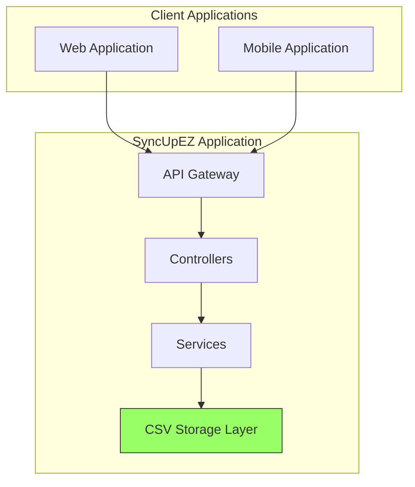

# SyncUpEZ CSV-Based Implementation Guide

## Overview

SyncUpEZ is a simplified version of the SyncUp platform that uses CSV files for data storage instead of the full polyglot persistence architecture (Neo4j, PostgreSQL, and InfluxDB). This lightweight implementation focuses on the core functionality of the Continuous Contribution Graph while eliminating complex dependencies like AI, GraphQL, and databases.

This guide provides technical documentation for developers who want to implement or extend SyncUpEZ with CSV-based storage.

## Architecture

SyncUpEZ follows a simplified architecture that replaces the multi-database approach with CSV file storage:



### Key Differences from Full SyncUp

| Feature | Full SyncUp | SyncUpEZ |
|---------|-------------|----------|
| Storage | Neo4j, PostgreSQL, InfluxDB | CSV Files |
| Querying | Database queries | File I/O operations |
| Scalability | High | Limited |
| Performance | Optimized | Basic |
| Complexity | High | Low |

## CSV File Structure

SyncUpEZ uses several CSV files to store different types of data:

### employees.csv
Stores basic employee information including authentication credentials.

| Field | Type | Description |
|-------|------|-------------|
| employee_id | string | Unique identifier for the employee |
| name | string | Employee's full name |
| email | string | Employee's email address (used for login) |
| password | string | Hashed password for authentication |
| department | string | Department the employee belongs to |
| team | string | Team within the department |
| role | string | Employee's role/title |
| hire_date | date | Date the employee was hired |

### interactions.csv
Stores workplace interactions (posts, stand-ups, project updates).

| Field | Type | Description |
|-------|------|-------------|
| interaction_id | string | Unique identifier for the interaction |
| employee_id | string | ID of the employee who created the interaction |
| type | string | Type of interaction (post, standup, project_update, etc.) |
| content | string | Text content of the interaction |
| timestamp | datetime | When the interaction was created |
| context_tags | string | Comma-separated tags for categorization |

### kudos.csv
Stores recognition and appreciation between employees.

| Field | Type | Description |
|-------|------|-------------|
| kudos_id | string | Unique identifier for the kudos |
| from_employee_id | string | ID of the employee giving kudos |
| to_employee_id | string | ID of the employee receiving kudos |
| message | string | Message content of the kudos |
| timestamp | datetime | When the kudos was given |

### contributions.csv
Stores pre-calculated contribution scores (to avoid complex real-time calculations).

| Field | Type | Description |
|-------|------|-------------|
| employee_id | string | ID of the employee |
| date | date | Date of the score |
| problem_solving_score | number | Score for problem-solving expertise (0-100) |
| collaboration_score | number | Score for collaboration (0-100) |
| initiative_score | number | Score for initiative (0-100) |
| overall_score | number | Overall contribution score (0-100) |

## Core Functionality Implementation

### 1. Data Ingestion

Instead of database INSERT operations, SyncUpEZ appends new records to CSV files. When a new interaction is created, it is added as a new row to the appropriate CSV file.

### 2. Data Retrieval

Instead of database SELECT queries, SyncUpEZ reads and filters CSV data. When retrieving information, the system reads the entire CSV file and filters the data in memory.

### 3. Contribution Scoring

The complex real-time scoring algorithms are replaced with periodic batch processing that reads all data and writes scores to contributions.csv. This approach simplifies implementation but requires scheduling regular processing runs.

## API Endpoints

SyncUpEZ provides simplified REST endpoints that read from and write to CSV files:

### Data Ingestion Endpoints

The system provides endpoints for ingesting employee data, workplace interactions, and kudos records.

### Analytics Retrieval Endpoints

Endpoints are available for retrieving individual and team contribution analytics.

### Dashboard Data Endpoints

Specialized endpoints provide data for leaderboards, collaboration visualization, and promotion alerts.

## File I/O Operations

### Reading CSV Files

The system reads CSV files by loading the entire file content and parsing it into data structures that can be manipulated in memory.

### Writing to CSV Files

Data is written to CSV files by converting in-memory data structures to CSV format and writing the entire file content.

### Appending to CSV Files

New records are appended to CSV files by adding new rows to the end of existing files.

## Continuous Contribution Graph Implementation

The Continuous Contribution Graph in SyncUpEZ is implemented through periodic batch processing rather than real-time analytics:

### 1. Quantifying Problem-Solving and Expertise

Instead of real-time Neo4j graph queries, SyncUpEZ analyzes interaction content for keywords and patterns to identify problem-solving activities.

### 2. Measuring Collaboration and Influence

Cross-functional kudos and collaboration are measured through simple counts of kudos received from different colleagues.

### 3. Visualizing Initiative and Growth

Initiative is detected through keyword analysis in interaction content, looking for words that indicate self-started projects or activities.

## HR Dashboard Implementation

The HR dashboard in SyncUpEZ reads pre-calculated scores from contributions.csv rather than performing complex real-time queries:

### Leaderboards

Leaderboards are generated by reading the contributions.csv file and sorting employees by their overall contribution scores.

### Collaboration Maps

Collaboration maps are created by analyzing kudos.csv data to identify patterns of recognition between employees.

## Authentication Implementation

SyncUpEZ implements a simple email and password authentication system using CSV-based storage. The authentication system uses bcrypt for password hashing and JWT for token generation.

### 1. Authentication Controller

The authentication controller handles login requests by validating credentials and generating JWT tokens:

```
// src/controllers/authController.js
const { readCSV } = require('../utils/csvReader');
const bcrypt = require('bcrypt');
const jwt = require('jsonwebtoken');
const path = require('path');

const EMPLOYEES_FILE = path.join(__dirname, '../../data/employees.csv');

async function login(req, res) {
  try {
    const { email, password } = req.body;
    
    // Validate input
    if (!email || !password) {
      return res.status(400).json({ error: 'Email and password are required' });
    }
    
    // Find employee by email
    const employees = await readCSV(EMPLOYEES_FILE);
    const employee = employees.find(emp => emp.email === email);
    
    if (!employee) {
      return res.status(401).json({ error: 'Invalid credentials' });
    }
    
    // Verify password
    const isPasswordValid = await bcrypt.compare(password, employee.password);
    
    if (!isPasswordValid) {
      return res.status(401).json({ error: 'Invalid credentials' });
    }
    
    // Generate JWT token
    const token = jwt.sign(
      { employee_id: employee.employee_id, email: employee.email },
      process.env.JWT_SECRET || 'default_secret',
      { expiresIn: '1h' }
    );
    
    // Remove password from response
    const { password: _, ...employeeData } = employee;
    
    res.json({
      success: true,
      token,
      employee: employeeData
    });
  } catch (error) {
    res.status(500).json({ error: 'Login failed' });
  }
}

module.exports = { login };
```

### 2. Authentication Routes

Authentication routes are defined separately to handle login requests:

```
// src/routes/authRoutes.js
const express = require('express');
const router = express.Router();
const authController = require('../controllers/authController');

/**
 * Authentication Routes
 */

// Login endpoint
router.post('/login', authController.login);

module.exports = router;
```

### 3. Integration with Main Application

The authentication routes are integrated into the main server:

```
// server.js (updated)
const express = require('express');
const app = express();
const PORT = process.env.PORT || 3000;

// Middleware
app.use(express.json());

// Import routes
const employeeRoutes = require('./src/routes/employeeRoutes');
const authRoutes = require('./src/routes/authRoutes');

// Use routes
app.use('/api/employees', employeeRoutes);
app.use('/api/auth', authRoutes);

// Basic route for testing
app.get('/', (req, res) => {
  res.json({ 
    message: 'SyncUpEZ Server Running', 
    version: '1.0.0',
    description: 'CSV-based implementation of SyncUp Continuous Contribution Graph'
  });
});

// Start server
app.listen(PORT, () => {
  console.log(`SyncUpEZ server is running on port ${PORT}`);
});

module.exports = app;
```

### 4. Employee Creation with Password Hashing

When creating new employees, passwords are hashed before storage:

```
// In employeeController.js
const bcrypt = require('bcrypt');

async function createEmployee(req, res) {
  try {
    const employee = req.body;
    
    // Validate required fields
    if (!employee.employee_id || !employee.name || !employee.email || !employee.password) {
      return res.status(400).json({ error: 'Missing required fields: employee_id, name, email, password' });
    }
    
    // Hash password
    employee.password = await bcrypt.hash(employee.password, 10);
    
    // Define headers for employees.csv
    const headers = [
      {id: 'employee_id', title: 'employee_id'},
      {id: 'name', title: 'name'},
      {id: 'email', title: 'email'},
      {id: 'password', title: 'password'},
      {id: 'department', title: 'department'},
      {id: 'team', title: 'team'},
      {id: 'role', title: 'role'},
      {id: 'hire_date', title: 'hire_date'}
    ];
    
    await appendCSV(EMPLOYEES_FILE, headers, employee);
    
    res.status(201).json({ message: 'Employee created successfully', employee });
  } catch (error) {
    res.status(500).json({ error: 'Failed to create employee' });
  }
}
```

### Password Hashing

Passwords are securely hashed using bcrypt before storage:

```javascript
const bcrypt = require('bcrypt');

// Hash password before saving
const hashPassword = async (password) => {
  const saltRounds = 10;
  return await bcrypt.hash(password, saltRounds);
};

// Compare password during login
const comparePassword = async (password, hash) => {
  return await bcrypt.compare(password, hash);
};
```

### Login Endpoint

The authentication system provides a login endpoint at `POST /api/auth/login`:

#### Request Body
``json
{
  "email": "user@example.com",
  "password": "userpassword"
}
```

#### Response
```json
{
  "success": true,
  "token": "jwt_token_here",
  "employee": {
    "employee_id": "emp_001",
    "name": "John Doe",
    "email": "john.doe@example.com",
    "department": "Engineering",
    "team": "Backend",
    "role": "Software Engineer",
    "hire_date": "2023-01-15"
  }
}
```

#### Error Responses
- 400 Bad Request: Missing email or password
- 401 Unauthorized: Invalid credentials
- 500 Internal Server Error: System error

### Security Considerations

1. **Password Storage**: Passwords are hashed using bcrypt before storage
2. **Token Expiration**: JWT tokens have a 1-hour expiration time
3. **Environment Variables**: JWT secret is stored in environment variables
4. **Input Validation**: All inputs are validated before processing
5. **Error Handling**: Generic error messages to prevent information leakage

## Performance Considerations

1. **File Locking**: Implement proper file locking mechanisms to prevent corruption when multiple processes access CSV files simultaneously.

2. **Batch Processing**: Schedule contribution score calculations during off-peak hours to minimize performance impact.

3. **File Size Management**: Implement log rotation or archiving for large CSV files to maintain performance.

4. **Caching**: Cache frequently accessed data in memory to reduce file I/O operations.

## Limitations

1. **Scalability**: CSV-based storage is not suitable for large organizations with thousands of employees and interactions.

2. **Concurrency**: Multiple simultaneous writes to CSV files can cause data corruption without proper locking mechanisms.

3. **Query Performance**: Complex queries that would be fast with databases become slow with file-based storage.

4. **Data Integrity**: CSV files lack the data integrity guarantees of databases.

## Deployment

SyncUpEZ can be deployed as a simple Node.js application that reads and writes CSV files. No database setup is required.

### Prerequisites
- Node.js runtime
- File system access
- Basic web server capabilities

### Required Dependencies

To implement the authentication system, you need to install additional dependencies:

```bash
npm install bcrypt jsonwebtoken
```

### Environment Configuration

Set the JWT secret in your environment variables:

```bash
JWT_SECRET=your_jwt_secret_here
```

### Starting the Application

The application can be started by installing dependencies and running the main server file. The application will create CSV files as needed and store all data in the local file system.

```bash
npm install
node server.js
```